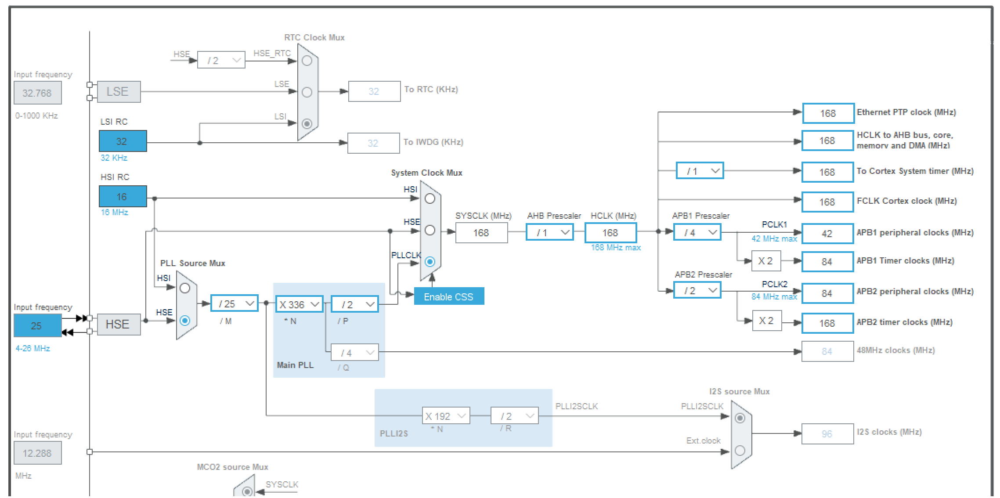
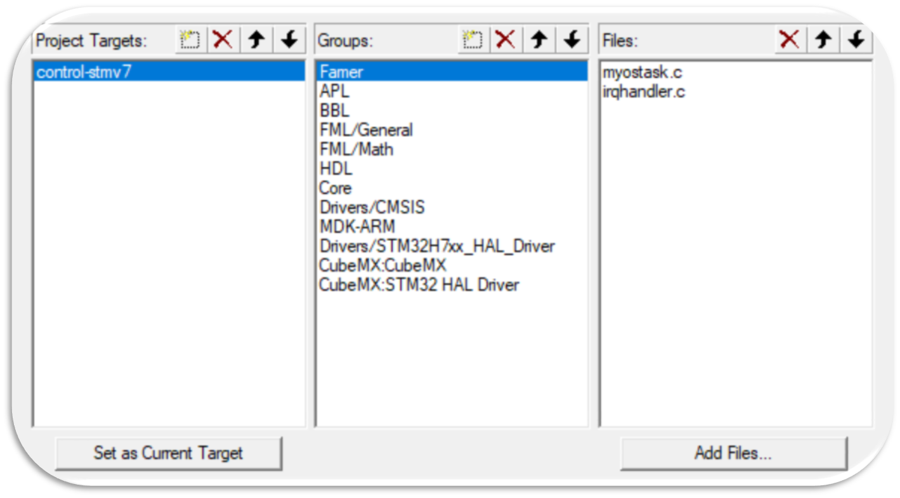

# 8.12总结
## 日志 
今天进一步认识了STM32的内部结构，并实操了编程的全流程，了解了keil平台debug的部分操作，除了因软件版本太低的插曲外，任务安排得很紧凑，整体难度适中，收获颇丰。
## 学习总结
### 时钟

时钟是单片机关键中的关键，其在芯片内的线路和布局也十分繁杂，要正确对应。 
| 时钟源 | 本质  | 频率 | 精度
|  ----  | ----  | ---- | ---- |
| HSE  | 外部晶体/时钟 | 4-26MHz | 低 |
| HSI  | 内部 RC 振荡器 | 16MHz | 低 |
### HAL库
全称为"Hardware Abstraction Layer"，即“硬件抽象层库”，与STM32CubeMX工具深度集成，可自动生成初始化代码，大大降低底层硬件配置复杂度。使用HAL库进行编写时，会有HAL_Init对HAL库进行初始化，同时要注意各代码的位置，如宏定义、全局变量、引用等等。
对GPIO进行操作：首先在cubeMX启用目标GPIO，设置好使用模式、初始电平等，之后在Keil中进行操作，例如HAL_GPIO_WritePin(BEEP_PORT, BEEP_PIN, GPIO_PIN_SET)，BEEP_PORT表示与蜂鸣器相连GPIO类别如GPIOA，BEEP_PIN表示与蜂鸣器相连GPIO端口，如8，GPIO_PIN_SET表示置1，GPIO_PIN_RESET则置0。
### 文件管理
使用Keil时注意文件分类，如软件自动生成的代码与自己封装的代码分开，同时区分.h与.c文件，命名（包括变量、函数命名）要体现作用，简明易懂，两种文件内容的排版要清晰。针对不同的硬件，或者常用的计算流程等，函数要进行单独封装，避免在主函数内宏定义再改名，并在结构中标明，调用时声明即可。

### 杂项
1.配置cubeMX时不要漏SYS要选SW，生成时选择MDK-ARM，合理分配堆栈空间。
2.keil选择正确的硬件包、环境包、编译器以及Debug，新增的Inc文件夹要在C/C++中添加路径。