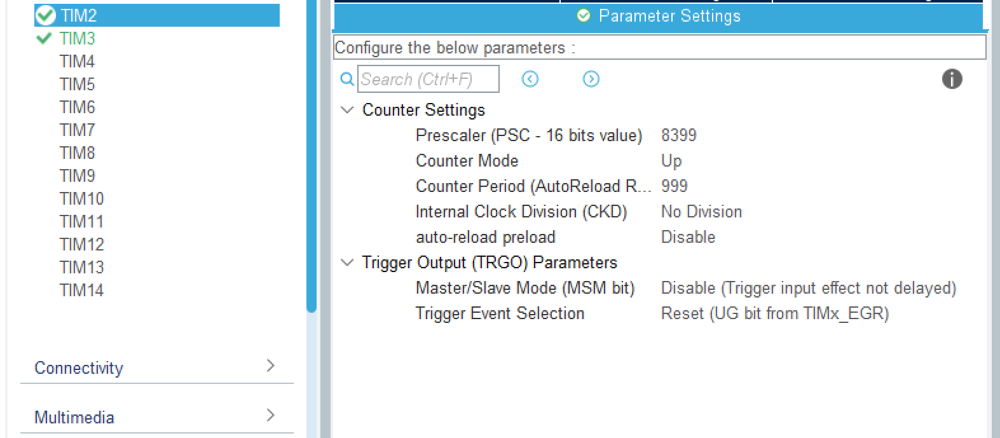

# 8.13总结
## 日志
今天学习了中断和定时器，实现了LED闪烁、定时发送、呼吸灯等效果，主要是操作上的问题，要对应加上代码，以及注意cubeMX的设置。
## 学习总结
### 中断
stm32通过嵌套向量中断控制器控制中断的优先级、响应时间以及如何嵌套和处理多个中断请求。其中优先级可分为抢占优先级和响应优先级。中断具有以下特点：  
异步性：中断可在主程序任意位置被触发。  
硬件驱动：事件由外设硬件检测并发出中断请求（IRQ）。  
自动保存现场：进入中断时，内核自动保存部分寄存器。  
自动恢复：中断处理结束后，返回被打断的程序位置继续执行。
### 定时器
定时器本质上是计数器，通过数时钟实现计时，例如向上计数模式：计数器从0计数到自动加载值(TIMx_ARR)，然后重新从0开始计数并且产生一个计数器溢出事件。此事件会触发中断，进而运行中断处理函数，即可实现定时操作。  
且有Time = (ARR + 1) * (PSC + 1) / Tclk，其中ARR为自动装载值，PSC为预分频系数，Tclk为定时器的APB时钟。图中参数即可实现定时0.1s.  

### PWM
Pulse Width Modulation，即脉冲宽度调制，是一种通过改变脉冲信号中高电平所占时间比例来控制平均输出电压或功率的技术。  
其中，定义占空比为高电平持续时间占一个完整周期的百分比，即空比=(高电平时间/总周期时间)×100%。显然，占空比越高,平均输出电压越高;占空比越低,平均电压越低。
例如，假设PWM信号频率为1kHz(周期1ms):占空比50%，即高电平0.5ms，低电平0.5ms，平均电压约为供电电压的一半；占空比75%，即高电平0.75ms，低电平0.25ms，平均电压约为供电电压的75%。