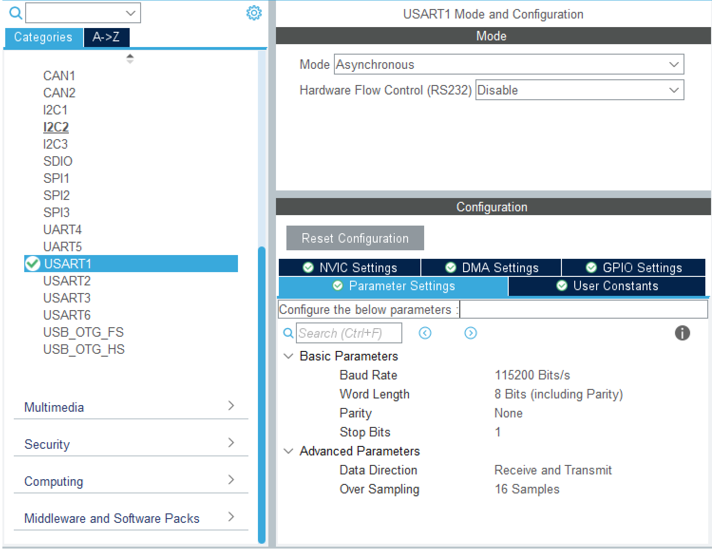
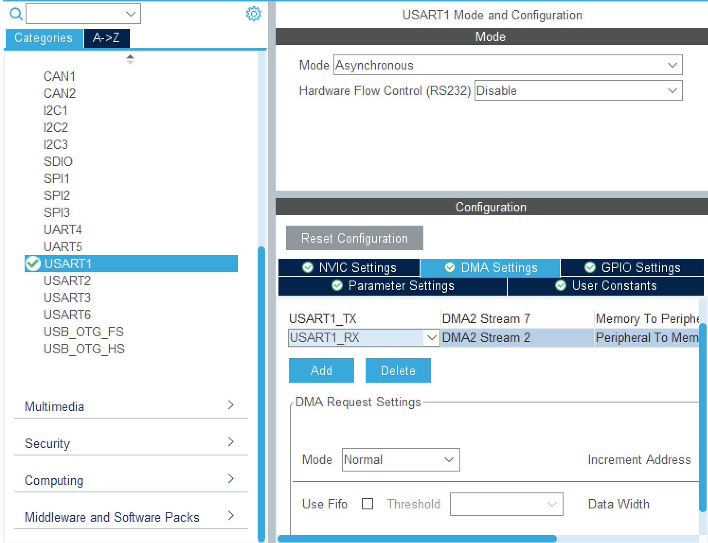

# 8_14总结
## 日志
主要学习了串口的收发，包括中断与DMA等，很有用，但改代码很红温，弄一下午发现线有问题，难度不低，仍需练习。
## 学习总结
### 串口
串口通信（Serial Communication），是指数据按位（bit）逐个顺序传输的通信方式，与并口通信的多位同时传输形成对比。这种方式虽然传输速度相对较慢，但所需的连线少，成本低，抗干扰能力强。  
波特率表示每秒钟传输码元的个数，是衡量数据传输速率的指标，单位Baud，通常为115200或9600，收发两者必须相同。
### UART/USART
UART为通用异步收发器(USART通用同步/异步收发器)，是最基本的串口通信接口，通常只需要两根数据线 - TXD（发送）和RXD（接收），VCC,加上地线GND。数据以帧的形式传输，每帧包含起始位、5-8位数据位、可选的奇偶校验位和1-2个停止位。 
 
设置UART时注意波特率以及**开启中断**，同时设置相应的接收或发送中断函数。
### DMA
DMA，全称Direct Memory Access，即直接存储器访问。DMA为两种外设提供一条数据通路，实现了自动完成数据传输，转移数据不再需要CPU参与，大大减轻了 CPU 的负担，适用于大数据量传输场景。  
