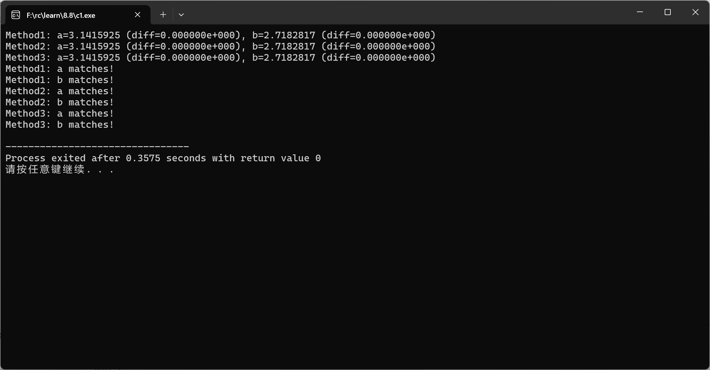

# 方法1：memcpy拷贝 memcpy(void *目标指针, const void *来源指针, size_t n拷贝个数);
## 存储
void store_floats_method1(float a, float b, char* buffer)**注意buffer是个地址**  
{
    memcpy(buffer, &a, sizeof(float));**从拷贝4个到buffer**
    memcpy(buffer + sizeof(float), &b, sizeof(float));
}
## 提取
void extract_floats_method1(const char* buffer, float* a, float* b)  
{
    memcpy(a, buffer, sizeof(float));
    memcpy(b, buffer + sizeof(float), sizeof(float));
}

# 方法2：union 联合体
**联合体的所有成员共享同一块内存空间。修改其中一个成员会影响其他成员的值（因为它们指向同一内存地址）**
**可读性：通过命名成员（如 f 和 bytes）明确操作意图。跨平台性：联合体行为由C标准定义，比直接指针操作更安全。**  

union FloatBytes {
    float f;
    char bytes[sizeof(float)];**两个成员**
};
## 存储
void store_floats_method2(float a, float b, char* buffer)  
{
    union FloatBytes u1, u2;
    u1.f = a;**将float值a存入联合体u1的f成员，此时bytes会自动填充为a的二进制表示**
    u2.f = b;
    for (int i = 0; i < sizeof(float); i++) {
        buffer[i] = u1.bytes[i];**拷贝a**
        buffer[i + sizeof(float)] = u2.bytes[i];**拷贝b**
    }
}
## 提取
void extract_floats_method2(const char* buffer, float* a, float* b)  
{
    union FloatBytes u1, u2;
    for (int i = 0; i < sizeof(float); i++) {
        u1.bytes[i] = buffer[i];
        u2.bytes[i] = buffer[i + sizeof(float)];
    }
    *a = u1.f;**对指针执行"✳"，即解引用指针，将联合体u1中的float成员f的值，赋值给指针 a 所指向的内存位置的 值**
    *b = u2.f;
}

# 方法3：指针强制转换
## 存储
void store_floats_method3(float a, float b, char* buffer)  
{
    *((float*)buffer) = a;**同上，直接写入a到buffer[0..3]**
    *((float*)(buffer + sizeof(float))) = b;
}
## 提取
void extract_floats_method3(const char* buffer, float* a, float* b)  
{
    *a = *((float*)buffer);
    *b = *((float*)(buffer + sizeof(float)));
}

没有差异